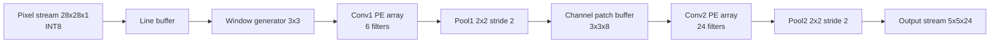
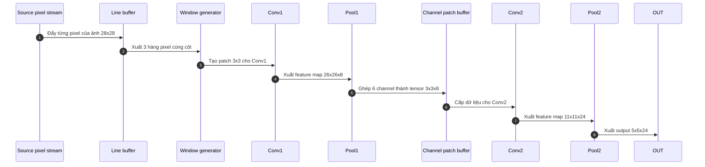
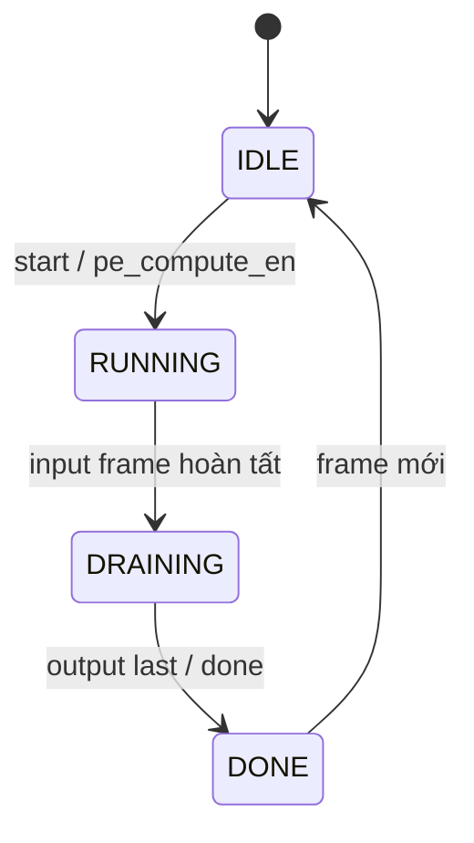
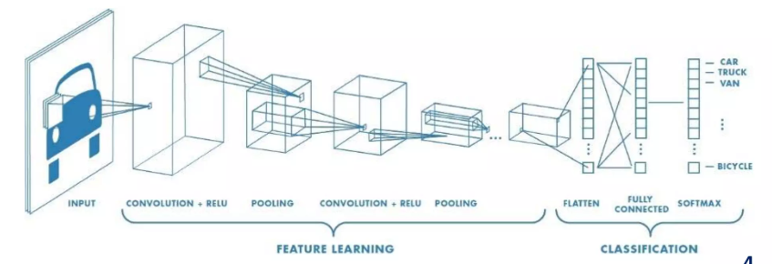
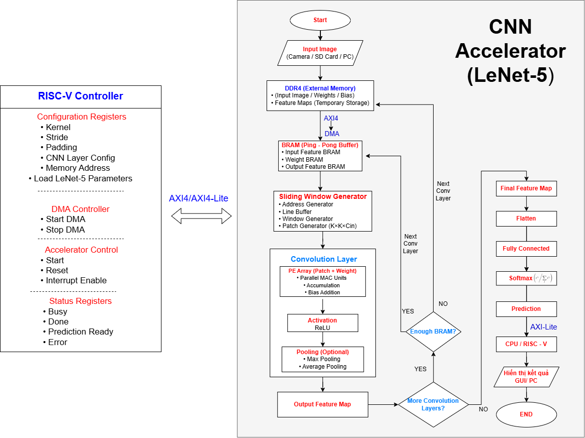
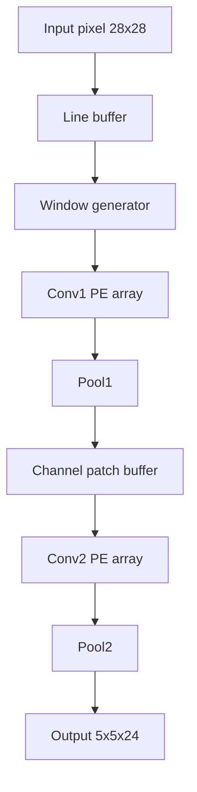

# Group 04 - CNN Feature Extractor IP Core

> Đồ án Thực tập PTIT - Nhóm 04
>
> Repository này hiện thực phần Feature Extractor của LeNet-5 bằng Verilog HDL theo hướng streaming pipeline. Mục tiêu là tái sử dụng dữ liệu qua line buffer và sliding window, giảm truy cập bộ nhớ trung gian, và tạo đầu ra 5x5x24 sẵn sàng ghép với khối FC hoặc phần xử lý phía sau.

## Mục Lục

1. [Tổng Quan](#tổng-quan)
2. [Kiến Trúc Xử Lý](#kiến-trúc-xử-lý)
3. [Bản Đồ Repository](#bản-đồ-repository)
4. [Phân Tích Từng Thư Mục](#phân-tích-từng-thư-mục)
5. [Các Luồng Chạy Chính](#các-luồng-chạy-chính)
6. [Tài Liệu & Hình Ảnh](#tài-liệu--hình-ảnh)
7. [Ghi Chú Khi Đọc Source](#ghi-chú-khi-đọc-source)

## Tổng Quan

Repository này không chỉ là một bộ RTL đơn lẻ. Nó gồm đủ các phần để theo dõi một flow thiết kế phần cứng hoàn chỉnh:

- RTL cho các khối xử lý lõi và các phiên bản phát triển theo từng giai đoạn.
- Testbench cho từng khối, từng stage, và các bộ mô phỏng tích hợp.
- Tài liệu tham khảo, báo cáo, slide, và hình minh họa kiến trúc.
- Các thư mục chờ mở rộng cho script, software, và nguồn tham chiếu.

Chuỗi xử lý chính đi từ ảnh 28x28x1 sang feature map 5x5x24 qua các stage:

1. Nhận pixel stream đầu vào.
2. Tạo line buffer cho ảnh.
3. Sinh patch 3x3 bằng sliding window.
4. Tính Conv1 với 8 filter.
5. Pool1 để giảm xuống 13x13x8.
6. Gom 8 channel patch để cấp cho Conv2.
7. Tính Conv2 với 24 filter.
8. Pool2 để tạo output 5x5x24.
9. Đóng gói output cho khối phía sau.

## Kiến Trúc Xử Lý

### Sơ Đồ Tổng Thể



### Luồng Dữ Liệu



### Điều Khiển Và Handshake

Thiết kế dùng start/ready/done cho scheduler và valid/last cho từng luồng dữ liệu. Cách này giúp mỗi khối có thể mô phỏng độc lập, nhưng vẫn ghép được thành một pipeline thống nhất.



## Bản Đồ Repository

| Thư mục | Vai trò | Người dùng nhận được gì |
| --- | --- | --- |
| `rtl/` | RTL Verilog cho từng khối và các bản ghép theo phiên bản | Mã nguồn phần cứng có thể đọc, mô phỏng và tích hợp vào FPGA |
| `testbench/` | Testbench cho unit-level, stage-level và system-level | Môi trường kiểm thử để xem waveform, valid/last và hành vi từng stage |
| `doc/` | PDF tài liệu board và paper tham khảo | Cơ sở lý thuyết, tài liệu phần cứng, hướng dẫn board |
| `images/` | Hình minh họa kiến trúc và flow | Ảnh dùng để giải thích hệ thống trong báo cáo hoặc slide |
| `report/` | Báo cáo và slide thực tập | Tài liệu tổng hợp kết quả, biểu đồ và phần trình bày |
| `scripts/` | Chỗ dành cho script sinh dữ liệu hoặc hỗ trợ mô phỏng | Hiện tại là scaffold, chưa có nội dung triển khai |
| `software/` | Chỗ dành cho phần mềm chạy trên PS hoặc driver | Hiện tại là scaffold, phục vụ mở rộng về sau |
| `src/` | Chỗ dành cho golden model, source tham chiếu hoặc HLS | Hiện tại là scaffold, chưa có file thực thi |

## Phân Tích Từng Thư Mục

### `rtl/`

Đây là thư mục quan trọng nhất. Nó chứa toàn bộ mô tả phần cứng và cả các phiên bản phát triển theo từng chặng.

```text
rtl/
├── channel_patch_buffer.v
├── channel_patch_buffer_ver3.v
├── conv1_pe_ver1.v
├── conv1_top_ver1.v
├── conv1_top_ver2.v
├── line_buffer1.v
├── line_buffer_model.v
├── line_buffer_model_ver3.v
├── pooling_conv1_ver1.v
├── sliding_window_top.v
├── sliding_window_top_ver3.v
├── top_sliding_window_ver1.v
├── window_gen.v
├── window_generate_ver3.v
├── window_generator_ver2.v
├── tuan3.1/
└── tuan3.2/
```

#### Nhóm file lõi ở root `rtl/`

| File | Vai trò chính | Ghi chú sử dụng |
| --- | --- | --- |
| `line_buffer1.v` | Phiên bản line buffer sớm | Dùng để xem logic khởi đầu |
| `line_buffer_model.v` | Bản line buffer cải tiến | Phù hợp khi đối chiếu tiến hóa thiết kế |
| `line_buffer_model_ver3.v` | Line buffer tối ưu cho luồng 28x28 | Là một trong các khối nền tảng của pipeline hiện tại |
| `window_gen.v` | Window generator thế hệ đầu | Chủ yếu để tham chiếu lịch sử |
| `window_generate_ver3.v` | Window generator ổn định hơn | Sinh patch 3x3 từ dữ liệu line buffer |
| `window_generator_ver2.v` | Phiên bản trung gian | Hữu ích khi so sánh các vòng tối ưu |
| `sliding_window_top.v` | Top của pipeline sliding window | Ghép line buffer và window generator |
| `sliding_window_top_ver3.v` | Bản sliding window tối ưu | Dùng trong luồng hệ thống mới hơn |
| `top_sliding_window_ver1.v` | Top thử nghiệm | Hữu ích khi debug phần sliding window |
| `conv1_pe_ver1.v` | PE tính Conv1 | Tính MAC 3x3, bias, quantization, ReLU |
| `pooling_conv1_ver1.v` | Pooling cho Conv1 | Max pooling 2x2 cho stage đầu |
| `channel_patch_buffer.v` | Bản ghép patch channel cũ | Phục vụ lịch sử phát triển |
| `channel_patch_buffer_ver3.v` | Bản ghép patch channel tối ưu | Ghép 6 channel từ Pool1 sang Conv2 |

#### `rtl/tuan3.1/`

Thư mục này là một mốc ghép stage sớm hơn, đã có pipeline Conv1, Pool1, Conv2, Pool2 nhưng vẫn giữ cấu trúc theo nhánh phát triển cũ.

```text
rtl/tuan3.1/
├── channel_patch_buffer_ver3.v
├── conv1_pe_ver1.v
├── conv1_top_ver3.v
├── conv1_top_ver4.v
├── conv2_pe.v
├── line_buffer_model_ver3.v
├── pooling_merge.v
├── sliding_window_top_ver3.v
├── top_conv1_pooling_ver1.v
├── top_conv2_pooling2.v
├── top_conv2_ver1.v
├── top_conv_axi4_lite_wrapper.v
├── top_conv_feature_extractor.v
└── window_generate_ver3.v
```

Nhóm này phù hợp khi bạn muốn:

- xem cách stage được ghép từng bước,
- đối chiếu giữa các bản top khác nhau,
- kiểm tra wrapper AXI4-Lite cũ,
- hoặc đọc lại quá trình tối ưu hóa từ bản đầu đến bản ghép hoàn chỉnh.

#### `rtl/tuan3.2/`

Đây là nhánh sạch hơn và gần với bản dùng thực tế hơn. Nó gom các khối chính theo cách rõ ràng hơn và tách rành mạch từng stage.

```text
rtl/tuan3.2/
├── channel_patch_buffer_ver3.v
├── conv1_pe.v
├── conv2_pe.v
├── conv_pool_ver1.v
├── line_buffer_model_ver3.v
├── pooling_merge.v
├── sliding_window_top_ver3.v
├── top_conv1.v
├── top_conv1_pooling1.v
├── top_conv2.v
├── top_conv2_pooling2.v
├── top_conv_axi_wrapper.v
├── top_conv_feature_extractor.v
└── window_generate_ver3.v
```

Các file quan trọng nhất ở nhánh này là:

| File | Nội dung |
| --- | --- |
| `top_conv_feature_extractor.v` | Top level ghép Conv1 -> Pool1 -> Conv2 -> Pool2 |
| `top_conv1.v` | Top cho stage Conv1 |
| `top_conv1_pooling1.v` | Ghép Conv1 với Pool1 |
| `top_conv2.v` | Top cho stage Conv2 |
| `top_conv2_pooling2.v` | Ghép Conv2 với Pool2 |
| `top_conv_axi_wrapper.v` | Wrapper giao tiếp stream/control |
| `pooling_merge.v` | Khối pooling gộp cho stage nhiều channel |
| `conv1_pe.v`, `conv2_pe.v` | Khối tính toán PE cho từng stage |

#### Khuyến nghị sử dụng RTL

- Nếu chỉ muốn đọc kiến trúc tổng thể, hãy bắt đầu từ `rtl/tuan3.2/top_conv_feature_extractor.v`.
- Nếu muốn hiểu từng stage, đọc theo thứ tự: `line_buffer_model_ver3.v` -> `window_generate_ver3.v` -> `conv1_pe.v` -> `top_conv1_pooling1.v` -> `top_conv2_pooling2.v`.
- Nếu muốn hiểu lịch sử phát triển, đối chiếu thêm với `rtl/tuan3.1/`.

### `testbench/`

Đây là thư mục mô phỏng và kiểm thử. Cấu trúc ở đây cho thấy repo không chỉ có RTL mà còn có bộ test để xác nhận từng khối.

```text
testbench/
├── tb_channel_patch_buffer_ver1.v
├── tb_channel_patch_ver3.v
├── tb_conv1_pe_ver1.v
├── tb_conv1_top_ver1.v
├── tb_line_buffer1.v
├── tb_line_buffer_model.v
├── tb_line_buffer_model_ver2.v
├── tb_line_ver3.v
├── tb_sliding_window_top.v
├── tb_sliding_window_top_ver2.v
├── tb_sliding_window_ver3.v
├── tb_top_sliding_window_ver21.v
├── tb_window_gen.v
├── tb_window_gen_ver3.v
├── tb_window_generate_ver2.v
├── sliding_window/
├── week_3_1/
├── week_3_2/
└── week4/
```

#### Nhóm testbench root

| File | Mục tiêu |
| --- | --- |
| `tb_line_buffer1.v` | Kiểm thử line buffer bản sớm |
| `tb_line_buffer_model.v` | Kiểm thử line buffer model |
| `tb_line_buffer_model_ver2.v` | Kiểm thử biến thể khác của line buffer |
| `tb_sliding_window_top.v` | Kiểm thử top của sliding window |
| `tb_sliding_window_top_ver2.v` | Phiên bản test thay thế |
| `tb_sliding_window_ver3.v` | Test cho sliding window ver3 |
| `tb_window_gen.v` | Kiểm thử window generator |
| `tb_window_generate_ver2.v` | Phiên bản test trung gian |
| `tb_window_gen_ver3.v` | Test cho window generator ver3 |
| `tb_conv1_pe_ver1.v` | Test PE Conv1 |
| `tb_conv1_top_ver1.v` | Test top Conv1 |
| `tb_channel_patch_buffer_ver1.v` | Test patch buffer bản đầu |
| `tb_channel_patch_ver3.v` | Test patch buffer bản tối ưu |

#### `testbench/week_3_1/`

Thư mục này gom các testbench của chặng tuần 3.1, chủ yếu xoay quanh Conv1, Pool1, Conv2 và pipeline ghép từng phần.

```text
testbench/week_3_1/
├── tb_conv1_pe_ver1.v
├── tb_conv1_pool1.v
├── tb_conv1_pool_ver1.v
├── tb_conv1_top_ver1.v
├── tb_conv2_pe.v
├── tb_conv2_pooling2.v
├── tb_conv_extractor.v
├── tb_sliding_window_ver3.v
├── tb_top_conv1_pooling_ver1.v
└── tb_top_conv2.v
```

#### `testbench/week_3_2/`

Đây là nhánh test gần với bản hoàn chỉnh hơn.

```text
testbench/week_3_2/
├── tb_conv_extractor.v
├── tb_conv_pool.v
└── tb_conv_pool_hex.v
```

Trong đó, `tb_conv_pool_hex.v` là file đáng chú ý nhất nếu bạn muốn nạp dữ liệu đầu vào dạng HEX/MEM và xem output stream theo kiểu giống pipeline thực tế.

#### `testbench/sliding_window/`

Đây là một project mô phỏng riêng cho phần sliding window, có cả file cấu hình Quartus/ModelSim.

Nội dung chính gồm:

- `line_buffer1.qpf`
- `line_buffer1.qsf`
- `line_buffer1.qws`
- `sliding_window_top.v`
- `tb_line_buffer1.v`
- `tb_sliding_window_top.v`
- `tb_window_gen.v`
- `window_gen.v`
- các thư mục `db/`, `incremental_db/`, `output_files/`, `simulation/`

Thư mục này phù hợp để:

- mở lại project mô phỏng cũ,
- xem waveform của line buffer/window generator,
- hoặc đối chiếu hành vi với bản RTL mới hơn.

#### `testbench/week4/`

Hiện thư mục này đang để trống, chỉ có file giữ chỗ. Có thể dùng cho các testbench mở rộng ở chặng sau.

### `doc/`

Thư mục tài liệu chứa các file PDF gốc để tham khảo phần cứng và nền tảng nghiên cứu.

```text
doc/
├── manual/
├── ug1182-zcu102-eval-bd.pdf
├── ug1221-zcu102-base-trd.pdf
└── xtp426-zcu102-quickstart.pdf
```

`doc/manual/` hiện chứa các paper tham khảo liên quan đến CNN FPGA, data reuse, row-stationary và các biến thể LeNet/accelerator khác:

- `2012.03672v1.pdf`
- `lenet-5-cnn-fpga.pdf`
- `paper_relevant.pdf`
- `relevant-prj.pdf`
- `row-stationary.pdf`
- `sliding_data-reuse_bandwidth.pdf`
- `source_intern_reference.pdf`

Thư mục này dùng để:

- tra cứu tài liệu board ZCU102,
- tìm cơ sở lý thuyết cho line buffer/sliding window,
- và trích dẫn trong báo cáo hoặc slide.

### `images/`

Thư mục ảnh hiện có các file minh họa kiến trúc, flow, và sơ đồ kỹ thuật.

```text
images/
├── algo_flowchart.png
├── Cnn_sliding.png
├── flowchart_CNN.png
├── Intern-system architecture.png
├── line_buffer_1.png
└── window_gen_1.png
```

Bạn có thể nhúng trực tiếp một vài ảnh chính vào README hoặc tài liệu thuyết minh:






### `report/`

Thư mục này chứa tài liệu đầu ra dạng báo cáo và slide.

```text
report/
├── Intern - PTIT - Slide.pdf
├── Report_Intern.docx
└── Tai_lieu_ky_thuat_CNN_Inference_FPGA.docx
```

Đây là nơi nên mở nếu bạn muốn xem:

- phần thuyết minh tổng hợp,
- nội dung báo cáo thực tập,
- hoặc bộ slide trình bày kết quả.

### `scripts/`

Thư mục này hiện là scaffold để dành cho script hỗ trợ.

Hiện tại nó chưa có file chức năng thực thi, chỉ giữ chỗ bằng `.gitkeep`. Khi mở rộng, đây có thể là nơi đặt:

- script sinh file `.mem` / `.hex`,
- script convert ảnh đầu vào,
- script hỗ trợ automation mô phỏng.

### `software/`

Thư mục này cũng đang là scaffold. Nó được giữ để sau này chứa phần mềm chạy trên PS, driver, hoặc code điều khiển IP core.

### `src/`

Thư mục này hiện cũng chỉ là scaffold.

Về lâu dài, nó có thể được dùng cho:

- golden model,
- source tham chiếu C/C++,
- hoặc mã HLS nếu muốn đối chiếu với RTL.

## Các Luồng Chạy Chính

### 1. Luồng xử lý RTL chính



### 2. Luồng đọc source theo mức độ

| Mức độ | Nên đọc file nào trước |
| --- | --- |
| Tổng quan hệ thống | `rtl/tuan3.2/top_conv_feature_extractor.v` |
| Sliding window | `rtl/tuan3.2/line_buffer_model_ver3.v`, `rtl/tuan3.2/window_generate_ver3.v` |
| Conv1 | `rtl/tuan3.2/conv1_pe.v`, `rtl/tuan3.2/top_conv1.v` |
| Pool1 | `rtl/tuan3.2/top_conv1_pooling1.v` |
| Conv2 | `rtl/tuan3.2/conv2_pe.v`, `rtl/tuan3.2/top_conv2.v` |
| Pool2 | `rtl/tuan3.2/top_conv2_pooling2.v` |
| Giao tiếp wrapper | `rtl/tuan3.2/top_conv_axi_wrapper.v` |

## Tài Liệu & Hình Ảnh

### Tài liệu nên xem trước

| File | Dùng để làm gì |
| --- | --- |
| `doc/ug1182-zcu102-eval-bd.pdf` | Xem board ZCU102 evaluation |
| `doc/ug1221-zcu102-base-trd.pdf` | Tra cứu base TRD của ZCU102 |
| `doc/xtp426-zcu102-quickstart.pdf` | Xem hướng dẫn quick start |
| `doc/manual/row-stationary.pdf` | Tham khảo dataflow và reuse strategy |
| `doc/manual/sliding_data-reuse_bandwidth.pdf` | Tham khảo tối ưu băng thông và reuse |
| `doc/manual/lenet-5-cnn-fpga.pdf` | Tham khảo kiến trúc CNN/LeNet-5 trên FPGA |

### Hình ảnh nên dùng khi thuyết minh

| Ảnh | Ý nghĩa |
| --- | --- |
| `images/Intern-system architecture.png` | Sơ đồ kiến trúc tổng thể |
| `images/Cnn_sliding.png` | Luồng sliding window CNN |
| `images/algo_flowchart.png` | Flow thuật toán |
| `images/line_buffer_1.png` | Mô tả line buffer |
| `images/window_gen_1.png` | Mô tả window generator |

## Ghi Chú Khi Đọc Source

- Nhiều file trong `rtl/` và `testbench/` là các mốc phát triển khác nhau. Tên file có hậu tố `ver1`, `ver2`, `ver3`, hoặc nằm trong `tuan3.1`, `tuan3.2` đều phản ánh lịch sử tối ưu hóa.
- Bản ghép hệ thống rõ ràng nhất nằm ở `rtl/tuan3.2/`.
- `scripts/`, `software/`, và `src/` hiện chưa có nội dung chức năng. Chúng là vị trí dành cho mở rộng sau này.
- Nếu bạn cần đọc theo luồng dữ liệu thực tế, hãy đi từ `line_buffer_model_ver3.v` tới `window_generate_ver3.v`, rồi sang `conv1_pe.v`, `top_conv1_pooling1.v`, `top_conv2_pooling2.v`, và cuối cùng là `top_conv_feature_extractor.v`.

## Tóm Tắt Nhanh

Repository này là một bộ source CNN feature extractor khá hoàn chỉnh, gồm RTL, testbench, tài liệu, ảnh minh họa, và báo cáo thực tập. Nếu bạn mới mở source lần đầu, điểm bắt đầu tốt nhất là `rtl/tuan3.2/top_conv_feature_extractor.v` và `testbench/week_3_2/tb_conv_pool_hex.v`.
