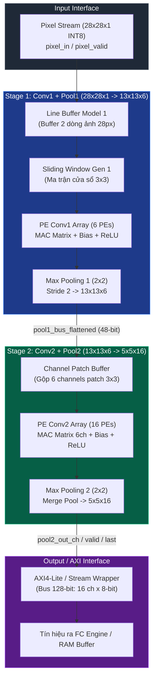
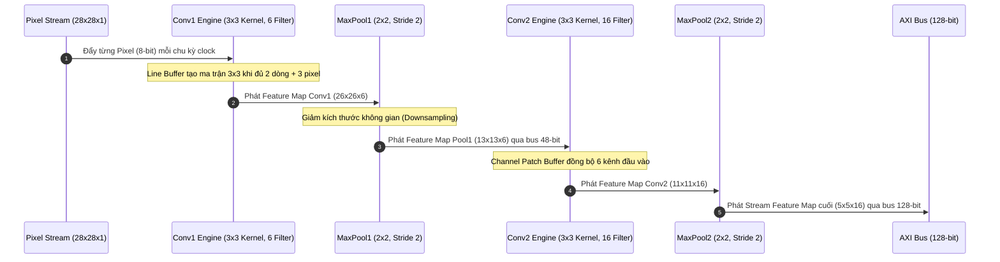
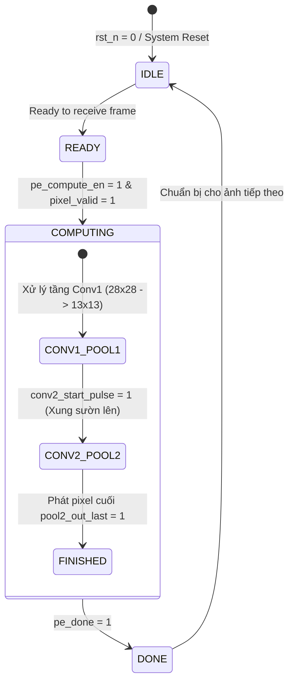

# 🚀 Group 04 - CNN Inference Accelerator IP Core trên FPGA ZCU102

> **Đồ án Thực tập PTIT - Nhóm 04**  
> **Chủ đề:** Thiết kế & Tối ưu hóa Vi kiến trúc Bộ tăng tốc Mạng Thần kinh Cuộn (CNN Inference Accelerator) cho Mô hình LeNet-5 (Feature Extractor Layer) trên FPGA Xilinx Zynq UltraScale+ ZCU102 / Intel Cyclone V.

---

## 📑 Mục Lục
1. [📌 Giới Thiệu Tổng Quan](#-giới-thiệu-tổng-quan)
2. [🏗️ Kiến Trúc Phần Cứng & Luồng Dữ Liệu](#-kiến-trúc-phần-cứng--luồng-dữ-liệu)
   - [2.1 Sơ Đồ Kiến Trúc Hệ Thống (Hardware Architecture)](#21-sơ-đồ-kiến-trúc-hệ-thống-hardware-architecture)
   - [2.2 Luồng Xử Lý Stream Dữ Liệu (Dataflow Pipeline)](#22-luồng-xử-lý-stream-dữ-liệu-dataflow-pipeline)
   - [2.3 Giao Thức Điều Khiển (Control & Handshake FSM)](#23-giao-thức-điều-khiển-control--handshake-fsm)
3. [📊 Thông Số Kỹ Thuật Vi Kiến Trúc (Hardware Specifications)](#-thông-số-kỹ-thuật-vi-kiến-trúc-hardware-specifications)
4. [📂 Phân Tích Kỹ Lưỡng Thư Mục Dự Án](#-phân-tích-kỹ-lưỡng-thư-mục-dự-án)
   - [4.1 Bảng Tổng Quan Thư Mục & Giá Trị Sử Dụng](#41-bảng-tổng-quan-thư-mục--giá-trị-sử-dụng)
   - [4.2 Thư Mục `rtl/` (Mã Nguồn Thiết Kế RTL Verilog)](#42-thư-mục-rtl-mã-nguồn-thiết-kế-rtl-verilog)
   - [4.3 Thư Mục `testbench/` (Môi Trường Mô Phỏng & Kiểm Thử)](#43-thư-mục-testbench-môi-trường-mô-phỏng--kiểm-thử)
   - [4.4 Thư Mục `doc/` (Tài Liệu Kỹ Thuật & Bài Báo Nghiên Cứu)](#44-thư-mục-doc-tài-liệu-kỹ-thuật--bài-báo-nghiên-cứu)
   - [4.5 Thư Mục `images/` (Hình Ảnh Kiến Trúc & Flowchart)](#45-thư-mục-images-hình-ảnh-kiến-trúc--flowchart)
   - [4.6 Thư Mục `report/` (Báo Cáo Kỹ Thuật & Slide Bảo Vệ)](#46-thư-mục-report-báo-cáo-kỹ-thuật--slide-bảo-vệ)
   - [4.7 Thư Mục `scripts/`, `software/`, `src/`](#47-thư-mục-scripts-software-src)
5. [🛠️ Hướng Dẫn Mô Phỏng & Kiểm Thử Phần Cứng](#-hướng-dẫn-mô-phỏng--kiểm-thử-phần-cứng)
   - [5.1 Yêu Cầu Công Cụ (Tools & Environment)](#51-yêu-cầu-công-cụ-tools--environment)
   - [5.2 Chạy Mô Phỏng Với Vivado / ModelSim](#52-chạy-mô-phỏng-với-vivado--modelsim)
   - [5.3 Chạy Dự Án Quartus Prime (Sliding Window)](#53-chạy-dự-án-quartus-prime-sliding-window)
6. [💡 Định Hướng Phát Triển Tiếp Theo](#-định-hướng-phát-triển-tiếp-theo)

---

## 📌 Giới Thiệu Tổng Quan

Dự án **Group4** tập trung nghiên cứu, thiết kế vi kiến trúc phần cứng tối ưu cho phần trích xuất đặc trưng (**Feature Extractor Core**) của mạng thần kinh cuộn **LeNet-5** chuyên dụng cho bài toán nhận dạng chữ số viết tay **MNIST** ($28 \times 28$ grayscale pixels).

Hệ thống được thiết kế hoàn toàn bằng ngôn ngữ **Verilog HDL**, tối ưu hóa cấu trúc luồng dữ liệu (Dataflow Streaming Pipeline), tái sử dụng dữ liệu bộ nhớ qua **Line Buffer Matrix** và **Sliding Window Generator**, giúp giảm thiểu tối đa băng thông truy xuất BRAM/RAM ngoại vi và đạt throughput cao.

> [!NOTE]
> Khối Feature Extractor đóng vai trò là IP Core phần cứng, có khả năng kết nối trực tiếp với SoC ARM Processing System (PS) thông qua chuẩn giao tiếp **AXI4-Lite / AXI-Stream** hoặc kết nối tới khối Fully Connected (FC) Engine phía sau.

---

## 🏗️ Kiến Trúc Phần Cứng & Luồng Dữ Liệu

### 2.1 Sơ Đồ Kiến Trúc Hệ Thống (Hardware Architecture)

Kiến trúc tổng thể kết nối liên hoàn giữa **Conv1 + Pool1** và **Conv2 + Pool2** dưới dạng luồng dữ liệu liên tục (Pipeline):



---

### 2.2 Luồng Xử Lý Stream Dữ Liệu (Dataflow Pipeline)

Toàn bộ quá trình biến đổi kích thước Feature Map được thực hiện hoàn toàn theo dạng luồng (streaming) mà không cần ghi trung gian ra RAM ngoại vi:



---

### 2.3 Giao Thức Điều Khiển (Control & Handshake FSM)

Các khối phần cứng trao đổi tín hiệu Handshake nhằm đảm bảo đồng bộ dữ liệu và tiết kiệm năng lượng:



---

## 📊 Thông Số Kỹ Thuật Vi Kiến Trúc (Hardware Specifications)

| Thông số (Parameter) | Giá trị (Value) | Mô tả chi tiết (Description) |
| :--- | :--- | :--- |
| **Ảnh đầu vào (Input)** | $28 \times 28 \times 1$ | Ảnh xám MNIST (Grayscale Image) |
| **Định dạng dữ liệu** | Fixed-point INT8 (8-bit signed) | Chuẩn hóa số nguyên 8-bit có dấu |
| **Tầng Conv1** | Kernel $3 \times 3$, Stride 1, 6 Filters | Đầu ra Feature Map: $26 \times 26 \times 6$ |
| **Tầng Pool1** | Max Pooling $2 \times 2$, Stride 2 | Đầu ra Feature Map: $13 \times 13 \times 6$ |
| **Tầng Conv2** | Kernel $3 \times 3$, Stride 1, 16 Filters | Đầu ra Feature Map: $11 \times 11 \times 16$ |
| **Tầng Pool2** | Max Pooling $2 \times 2$, Stride 2 | Đầu ra Feature Map: $5 \times 5 \times 16$ |
| **Kích thước đầu ra** | $5 \times 5 \times 16$ ($400$ values) | Đẩy trực tiếp sang tầng Fully Connected (FC) |
| **Băng thông bus đầu ra** | 128-bit Bus ($16 \text{ channels} \times 8 \text{ bits}$) | Truyền song song 16 kênh ra bus bộ nhớ |
| **Tần số xung Clock** | 100 MHz (Target FPGA ZCU102) | Chu kỳ clock 10ns |
| **Giao thức điều khiển** | Handshake `valid/ready/last` + AXI4-Lite | Dễ dàng ghép nối DMA / PS Subsystem |

---

## 📂 Phân Tích Kỹ Lưỡng Thư Thư Mục Dự Án

### 4.1 Bảng Tổng Quan Thư Mục & Giá Trị Sử Dụng

| Thư mục | Nội dung chính bên trong | Người dùng sẽ nhận được gì? | Công dụng & Cách khai thác |
| :--- | :--- | :--- | :--- |
| 📁 [`rtl/`](rtl/) | Toàn bộ mã Verilog HDL thiết kế phần cứng các khối CNN (`tuan3.1/`, `tuan3.2/`) | Mã nguồn RTL thương mại hóa, synthesized & pipelined | Tổng hợp IP Core bằng Vivado / Quartus, tích hợp vào SOC |
| 📁 [`testbench/`](testbench/) | Testbench Verilog, script mô phỏng Quartus/ModelSim (`sliding_window/`, `tuan3.1/`, `tuan3.2/`) | Bộ môi trường kiểm thử đầy đủ từ unit test tới full pipeline | Chạy mô phỏng kiểm tra dạng sóng (waveform), latency, accuracy |
| 📁 [`doc/`](doc/) | User Guide board ZCU102 & 8 Bài báo khoa học quốc tế (`doc/manual/`) | Tài liệu phần cứng gốc của Xilinx + Cơ sở lý thuyết CNN FPGA | Tra cứu sơ đồ chân ZCU102, học thuật thuật toán Line Buffer & Data Reuse |
| 📁 [`images/`](images/) | 6 hình ảnh sơ đồ kiến trúc, flowchart giải thuật, sơ đồ Line Buffer | Sơ đồ trực quan hóa vi kiến trúc phần cứng | Dùng để học tập, làm báo cáo, slide thuyết trình |
| 📁 [`report/`](report/) | Báo cáo chi tiết kỹ thuật (`.docx`) & Slide báo cáo đợt thực tập (`.pdf`) | Báo cáo hoàn chỉnh về Latency, Tài nguyên, BRAM, LUT | Tham khảo tài liệu báo cáo thực tập, cấu trúc thuyết minh kỹ thuật |
| 📁 [`scripts/`](scripts/) | Thư mục chứa script bổ trợ (Python/Bash) | Công cụ sinh dữ liệu kiểm thử, vector ảnh `.MEM` | Chuyển đổi ảnh PNG/JPG sang file hexa INT8 để nạp testbench |
| 📁 [`software/`](software/) | Thư mục chứa driver / ứng dụng C trên ARM PS | Phần mềm giao tiếp ARM Cortex-A53 với IP Core qua AXI | Lập trình C điều khiển IP core chạy thực tế trên bo mạch |
| 📁 [`src/`](src/) | Thư mục chứa mã nguồn mở rộng / Vivado HLS | Mã nguồn C/C++ tham chiếu hoặc HLS | Chạy mô hình kiểm tra đối chứng (Golden Model) |

---

### 4.2 Thư Thư Mục `rtl/` (Mã Nguồn Thiết Kế RTL Verilog)

Thư mục [`rtl/`](rtl/) chứa toàn bộ mã nguồn mô tả phần cứng (Hardware Description Language) theo các giai đoạn phát triển:

```
rtl/
├── channel_patch_buffer.v          # Bộ đệm Patch 3x3 cho nhiều channel (Ver 1)
├── channel_patch_buffer_ver3.v     # Bộ đệm Patch 3x3 đa kênh tối ưu Latency (Ver 3)
├── conv1_pe_ver1.v                 # Khối xử lý tính toán PE cho Conv1 (MAC array + Bias + ReLU)
├── conv1_top_ver1.v                # Top module tầng Conv1 phiên bản 1
├── conv1_top_ver2.v                # Top module tầng Conv1 phiên bản 2 (tối ưu pipeline)
├── line_buffer1.v                  # Khối Line Buffer dòng phiên bản 1
├── line_buffer_model.v             # Khối Line Buffer dòng phiên bản 2 (RAM/Shift Reg)
├── line_buffer_model_ver3.v        # Khối Line Buffer chuẩn tối ưu cho ảnh 28x28 (Ver 3)
├── pooling_conv1_ver1.v            # Khối Max Pooling 2x2 đơn kênh (Ver 1)
├── sliding_window_top.v            # Top module tạo cửa sổ trượt (Line Buffer + Window Gen)
├── sliding_window_top_ver3.v       # Top module cửa sổ trượt tối ưu Ver 3
├── top_sliding_window_ver1.v       # Top module kiểm thử cửa sổ trượt Ver 1
├── window_gen.v                    # Khối sinh cửa sổ trượt 3x3 từ Line Buffer (Ver 1)
├── window_generate_ver3.v          # Khối sinh cửa sổ trượt 3x3 (Ver 3)
├── window_generator_ver2.v        # Khối sinh cửa sổ trượt 3x3 (Ver 2)
├── tuan3.1/                        # 📁 Phiên bản RTL Ver 3.1 (Ghép nối Conv1+Pool1 và Conv2+Pool2)
└── tuan3.2/                        # 📁 Phiên bản RTL Ver 3.2 (Phiên bản chuẩn tối ưu nhất)
```

#### Phân Tích Các Khối RTL Cốt Lõi (Core RTL Modules):

1. **`line_buffer_model_ver3.v`**:
   - **Chức năng:** Nhận stream pixel đầu vào, sử dụng bộ đệm dòng (Shift Registers/FIFO) để giữ 2 dòng ảnh liền kề.
   - **Đầu ra:** Xuất đồng thời 3 hàng pixel ($3 \times 1$) giúp hệ thống đọc ma trận $3 \times 3$ liên tục mỗi chu kỳ clock.
2. **`window_generate_ver3.v`**:
   - **Chức năng:** Nhận 3 hàng pixel từ Line Buffer, đẩy qua thanh ghi trượt để tạo ra ma trận $3 \times 3$ (9 pixels) song song.
3. **`conv1_pe_ver1.v` & `conv2_pe.v`**:
   - **Chức năng:** Processing Element (PE) thực hiện 9 phép nhân MAC ($8\text{-bit} \times 8\text{-bit} \rightarrow 16\text{-bit}$), cây cộng (Adder Tree), cộng Bias, qua hàm kích hoạt **ReLU** và cắt/dịch bít định dạng lại INT8.
4. **`channel_patch_buffer_ver3.v`**:
   - **Chức năng:** Ghép nối và đồng bộ 6 kênh dữ liệu đầu ra từ Pool1 để chuẩn bị ma trận đầu vào 6-channel $3 \times 3$ cho tầng Conv2.
5. **`pooling_merge.v`**:
   - **Chức năng:** Tích hợp bộ đệm dòng và bộ so sánh giá trị lớn nhất (Max Operator) trên cửa sổ $2 \times 2$ cho cả 16 kênh song song.
6. **`top_conv_feature_extractor.v`** (`rtl/tuan3.2/`):
   - **Chức năng:** Khối Top Level hợp nhất toàn bộ luồng Conv1 $\rightarrow$ Pool1 $\rightarrow$ Conv2 $\rightarrow$ Pool2 thành 1 IP Core thống nhất.
7. **`top_conv_axi_wrapper.v` / `top_conv_axi4_lite_wrapper.v`**:
   - **Chức năng:** Bọc khối Feature Extractor chuẩn giao tiếp AXI4-Stream (`axis_in_valid`, `axis_in_data`, `axis_out_valid`, `axis_out_data`, `axis_out_last`) và AXI4-Lite Control.

---

### 4.3 Thư Thư Mục `testbench/` (Môi Trường Mô Phỏng & Kiểm Thử)

Thư mục [`testbench/`](testbench/) cung cấp đầy đủ file Verilog Testbench từ mức độ linh kiện (Unit Level) tới toàn bộ hệ thống (System Level):

```
testbench/
├── tb_channel_patch_buffer_ver1.v  # Testbench cho bộ đệm Patch kênh Ver 1
├── tb_channel_patch_ver3.v         # Testbench cho bộ đệm Patch kênh Ver 3
├── tb_conv1_pe_ver1.v              # Testbench kiểm thử 1 đơn vị PE Conv1
├── tb_conv1_top_ver1.v             # Testbench cho tầng Conv1 Top
├── tb_line_buffer1.v               # Testbench kiểm thử khối Line Buffer 1
├── tb_line_buffer_model.v          # Testbench khối Line Buffer 2
├── tb_line_buffer_model_ver2.v     # Testbench khối Line Buffer 2
├── tb_line_ver3.v                  # Testbench kiểm thử Line Buffer Ver 3
├── tb_sliding_window_top.v         # Testbench khối Sliding Window Top
├── tb_sliding_window_top_ver2.v    # Testbench khối Sliding Window Top Ver 2
├── tb_sliding_window_ver3.v        # Testbench khối Sliding Window Ver 3
├── tb_top_sliding_window_ver21.v   # Testbench toàn diện Cửa sổ trượt
├── tb_window_gen.v                 # Testbench khối Window Generator
├── tb_window_gen_ver3.v            # Testbench khối Window Generator Ver 3
├── tb_window_generate_ver2.v       # Testbench khối Window Generator Ver 2
├── sliding_window/                 # 📁 Project mô phỏng Intel Quartus Prime & ModelSim
│   ├── line_buffer1.qpf            # File Project Quartus
│   ├── line_buffer1.qsf            # File Cấu hình Settings Quartus
│   └── simulation/modelsim/        # Script .do và kết quả mô phỏng ModelSim
├── tuan3.1/                        # 📁 Testbench cho các khối thuộc Ver 3.1
│   ├── tb_conv1_pe_ver1.v
│   ├── tb_conv1_pool1.v
│   ├── tb_conv2_pe.v
│   ├── tb_conv2_pooling2.v
│   └── tb_conv_extractor.v
└── tuan3.2/                        # 📁 Testbench hoàn chỉnh nhất cho Ver 3.2
    ├── tb_conv_extractor.v         # Testbench kiểm thử bộ Feature Extractor
    ├── tb_conv_pool.v              # Testbench nhanh khối Conv + Pool
    └── tb_conv_pool_hex.v          # Testbench nâng cao nạp file dữ liệu ảnh Hex (.MEM)
```

> [!TIP]
> **File Testbench Quan Trọng Nhất:** File [`testbench/tuan3.2/tb_conv_pool_hex.v`](testbench/tuan3.2/tb_conv_pool_hex.v) hỗ trợ đọc ảnh đầu vào 28x28 dạng file hex `.MEM`, tự động đẩy stream dữ liệu vào RTL IP Core và ghi lại kết quả mô phỏng 16 kênh $5 \times 5$ để so sánh trực quan.

---

### 4.4 Thư Thư Mục `doc/` (Tài Liệu Kỹ Thuật & Bài Báo Nghiên Cứu)

Thư mục [`doc/`](doc/) lưu trữ các tài liệu chính hãng Xilinx cho bo mạch ZCU102 cùng các công trình nghiên cứu khoa học làm nền tảng vi kiến trúc:

```
doc/
├── ug1182-zcu102-eval-bd.pdf       # Xilinx ZCU102 Evaluation Board User Guide (Sơ đồ chân, FPGA Pinout, BRAM, Clocks)
├── ug1221-zcu102-base-trd.pdf      # ZCU102 Base Targeted Reference Design Guide (Thiết kế mẫu AXI & Vivado)
├── xtp426-zcu102-quickstart.pdf    # ZCU102 Quick Start Guide (Hướng dẫn khởi động & cấp nguồn bo mạch)
└── manual/                         # 📁 Thư mục bài báo nghiên cứu khoa học (Academic Research Papers)
    ├── 2012.03672v1.pdf            # Nghiên cứu tối ưu hóa phần cứng CNN
    ├── cnn_fpga_web.pdf            # Tài liệu tổng quan thiết kế CNN trên FPGA
    ├── lenet-5-cnn-fpga.pdf        # Kiến trúc triển khai LeNet-5 trên phần cứng FPGA
    ├── paper_relevant.pdf          # Tổng hợp các kỹ thuật tăng tốc phần cứng Deep Learning
    ├── relevant-prj.pdf            # Phân tích các đồ án và IP Core liên quan
    ├── row-stationary.pdf          # Kỹ thuật luồng dữ liệu Row-Stationary (Eyeriss Architecture)
    ├── sliding_cnn_web.pdf         # Giải thuật Cửa sổ trượt song song trên FPGA
    └── sliding_data-reuse_bandwidth.pdf # Kỹ thuật tái sử dụng dữ liệu Line Buffer để tối ưu băng thông RAM
```

---

### 4.5 Thư Thư Mục `images/` (Hình Ảnh Kiến Trúc & Flowchart)

Thư mục [`images/`](images/) chứa các sơ đồ nguyên lý phần cứng được trích xuất từ báo cáo và slide:

| Tên File | Mô tả chi tiết hình ảnh |
| :--- | :--- |
| 🖼️ [`images/Cnn_sliding.png`](images/Cnn_sliding.png) | Sơ đồ minh họa nguyên lý cửa sổ trượt 3x3 trên ảnh 2D |
| 🖼️ [`images/Intern-system architecture.png`](images/Intern-system architecture.png) | Sơ đồ kiến trúc tổng thể toàn hệ thống kết nối với SoC |
| 🖼️ [`images/algo_flowchart.png`](images/algo_flowchart.png) | Flowchart giải thuật xử lý tính toán từng tầng |
| 🖼️ [`images/flowchart_CNN.png`](images/flowchart_CNN.png) | Sơ đồ luồng dữ liệu từ ảnh MNIST đến kết quả Feature Map |
| 🖼️ [`images/line_buffer_1.png`](images/line_buffer_1.png) | Sơ đồ kết cấu bộ nhớ Line Buffer (Shift Registers & RAM) |
| 🖼️ [`images/window_gen_1.png`](images/window_gen_1.png) | Sơ đồ khối thanh ghi trượt Window Generator |

---

### 4.6 Thư Thư Mục `report/` (Báo Cáo Kỹ Thuật & Slide Bảo Vệ)

Thư mục [`report/`](report/) lưu trữ kết quả đầu ra tổng kết của nhóm trong đợt thực tập tại PTIT:

1. 📄 [`report/Tai_lieu_ky_thuat_CNN_Inference_FPGA.docx`](report/Tai_lieu_ky_thuat_CNN_Inference_FPGA.docx):
   - Báo cáo thuyết minh kỹ thuật chi tiết.
   - Trình bày toán học phép cuộn INT8, phương pháp lượng tử hóa (Quantization), sơ đồ thời gian (Timing diagram), latency từng tầng, tài nguyên tổng hợp trên FPGA (LUTs, FFs, BRAMs, DSP48E2).
2. 📊 [`report/Intern - PTIT - Slide.pdf`](report/Intern - PTIT - Slide.pdf):
   - Slide thuyết trình bảo vệ kết quả thực tập.
   - Tổng quan đề tài, giải pháp vi kiến trúc, kết quả mô phỏng Waveform và so sánh hiệu năng.

---

### 4.7 Thư Thư Mục `scripts/`, `software/`, `src/`

- 📁 [`scripts/`](scripts/): Dành cho các script tự động hóa (Python / Bash) tạo file dữ liệu ảnh thử nghiệm `.MEM` từ tập dữ liệu MNIST.
- 📁 [`software/`](software/): Dành cho mã nguồn C/C++ chạy trên vi xử lý ARM PS của ZCU102 để gửi nhận dữ liệu với FPGA IP Core qua AXI DMA.
- 📁 [`src/`](src/): Dành cho mã nguồn tham chiếu HLS (Vivado HLS C/C++) hoặc mô hình phần mềm kiểm tra đối chứng.

---

## 🛠️ Hướng Dẫn Mô Phỏng & Kiểm Thử Phần Cứng

### 5.1 Yêu Cầu Công Cụ (Tools & Environment)

Để chạy và phát triển dự án, bạn cần cài đặt một trong các công cụ sau:
- **AMD Xilinx Vivado ML Edition** (Phiên bản 2020.1 trở lên - Khuyến nghị Vivado 2022.2 hoặc 2023.1).
- **Intel Quartus Prime** (Phiên bản Lite hoặc Standard - cho dự án trong `testbench/sliding_window`).
- **ModelSim / Questasim** hoặc **EDaplayground / Icarus Verilog + GTKWave** để xem dạng sóng RTL.

---

### 5.2 Chạy Mô Phỏng Với Vivado / ModelSim

#### Bước 1: Mở phần mềm mô phỏng (Vivado XSim hoặc ModelSim)

#### Bước 2: Add mã nguồn RTL và Testbench phiên bản chuẩn nhất (`tuan3.2`)
- Thêm tất cả các file trong thư mục `rtl/tuan3.2/*.v`
- Thêm file testbench `testbench/tuan3.2/tb_conv_pool_hex.v`

#### Bước 3: Thêm đường dẫn file Hex dữ liệu ảnh
Trong file `tb_conv_pool_hex.v`, chỉnh sửa đường dẫn tham số `HEX_PATH` trỏ tới file `.mem` dữ liệu ảnh MNIST của bạn:
```verilog
parameter HEX_PATH = "E:/path_to_your_project/testbench/tuan3.2/hex/";
```

#### Bước 4: Chạy mô phỏng (Run Behavioral Simulation)
- Thời gian chạy mô phỏng khuyến nghị: `100us`.
- Quan sát các tín hiệu quan trọng trên Waveform:
  - `clk`, `rst_n`
  - `pixel_valid`, `pixel_in`
  - `pool1_out_valid`, `pool1_bus_flattened`
  - `pool2_out_valid`, `pool2_out_ch` (Bus 128-bit)
  - `pe_done` / `pool2_out_last`

---

### 5.3 Chạy Dự Án Quartus Prime (Sliding Window)

1. Mở Intel Quartus Prime.
2. Đường dẫn file project: `testbench/sliding_window/line_buffer1.qpf`.
3. Nhấn **Compile Design** để kiểm tra tính tổng hợp (Synthesis) và lượng tài nguyên LE/ALUT tiêu thụ.
4. Mở ModelSim từ Menu **Tools -> Run Simulation Tool -> RTL Simulation**.

---

## 💡 Định Hướng Phát Triển Tiếp Theo

- [ ] Hoàn thiện tầng **Fully Connected (FC Layer)** để xuất trực tiếp kết quả phân loại 10 chữ số (Digit 0-9).
- [ ] Tích hợp bộ **AXI DMA Core** hỗ trợ nhận/truyền trực tiếp qua RAM DDR4 của bo mạch ZCU102.
- [ ] Đóng gói thành **IP Core Vivado (IP Catalog)** có giao diện AXI4-Stream tiêu chuẩn.
- [ ] Thử nghiệm chạy thực tế (On-board Hardware Validation) trên bo mạch FPGA Xilinx ZCU102.

---

<p align="center">
  <i>Đồ án được thực hiện bởi <b>Nhóm 04 - PTIT Internship Program</b>.</i>
</p>
